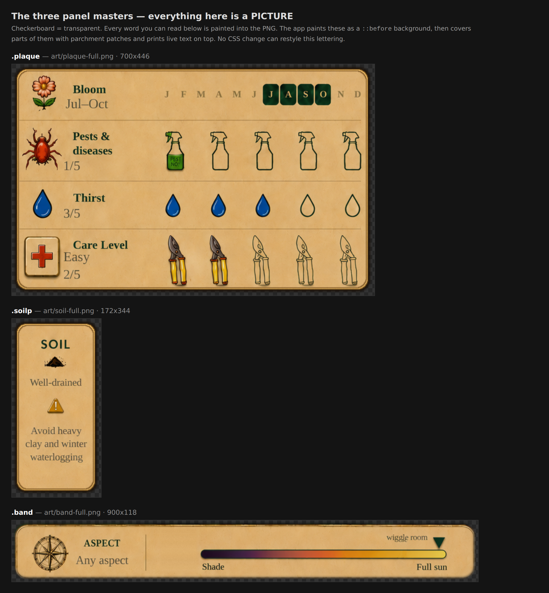
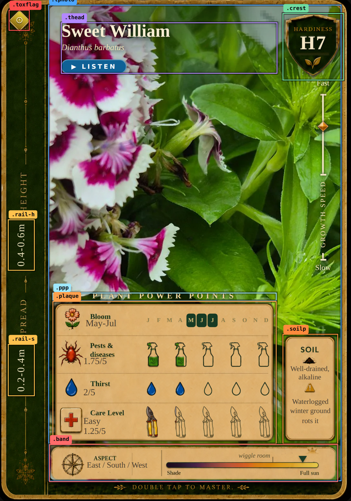

# Card layout — how the front is actually built, and how to change any part of it

This is the **mechanics** doc. It answers one question: *if I want to move,
resize, restyle or add a thing on the card front, what do I edit and what will
fight me?*

It is deliberately not the other three:

| Doc | What it is |
|---|---|
| `CARD-DESIGN-SYSTEM.md` | the design *intent* — rules, grid, palette, what the card should be |
| `FRAME-BRIEF.md` | how to commission new **frame** artwork from an image model |
| `CORRECTION-PROTOCOL.md` | the observe → fix → insulate loop for layout defects |
| **this file** | the wiring underneath all three |

Every number below was measured from the live DOM on 2026-09-16, not copied from
a spec. Regenerate them any time with the scripts in
[§9](#9-regenerating-the-maps).

---

## 1. The one thing to understand first

**Most of the card's furniture is a photograph of furniture.**

Three PNGs carry the panels, and they have the labels *and a set of placeholder
values* painted into them:



Read that image carefully, because it is the root cause of most of what looks
sloppy:

- `plaque-full.png` has **"Bloom"**, **"Pests & diseases"**, **"Thirst"**,
  **"Care Level"** baked as lettering — *and* baked placeholder values
  (`Jul–Oct`, `1/5`, `3/5`, `Easy 2/5`) *and* a baked month strip with
  **J A S O already lit**.
- `soil-full.png` has **"SOIL"**, a soil glyph, a warning triangle, and the
  placeholder text `Well-drained` / `Avoid heavy clay and winter waterlogging`.
- `band-full.png` has **"ASPECT"**, `Any aspect`, the compass rose, the
  Shade→Full sun gradient, **"Shade"**, **"Full sun"**, *"wiggle room"* and the
  pointer triangle.

So for every real card the app must **erase** the baked placeholders and print
live values over the top. That erasing is the `.patch` system
([§5](#5-the-patch-system--how-the-app-erases-baked-art)), and its soft feathered
edges are the "paper faded spray of colour" you can see around the light bar.

**Consequence:** no CSS change can restyle `Bloom`, `Thirst`, `SOIL`, `ASPECT`,
`Shade` or `Full sun`. They are pixels. Changing their size, weight, spacing or
wording means **re-rendering the panel art**, then re-measuring every patch and
value that was positioned against it.

---

## 2. Region map



All values are **% of the `.tcard` box**, measured live. `.tcard` is the
reference frame for everything; it is *larger* than the `.card` wrapper it sits
in, so always measure against `.tcard`.

| selector | left % | top % | width % | height % | drawn by |
|---|---|---|---|---|---|
| `.tcard` | 0 | 0 | 100 | 100 | `art/frame-600.webp` — outline, spine, bottom strip |
| `.tphoto` | 13.96 | 1.33 | 83.05 | 94.29 | the photograph, `object-fit:cover` |
| `.thead` | 17.70 | 4.89 | 61.18 | 10.05 | **CSS text** — title, latin, LISTEN |
| `.crest` | 80.33 | 2.92 | 17.23 | 13.46 | `art/crest-blank.webp` + CSS `.hnum` |
| `.toxflag` | 2.93 | 2.39 | 5.93 | 4.15 | **pure CSS** gradient + inline SVG |
| `.rail-h` | 2.72 | 43.77 | 7.62 | 10.16 | `art/rail-patch-h.png` + CSS value |
| `.rail-s` | 2.72 | 68.52 | 7.62 | 10.28 | `art/rail-patch-s.png` + CSS value |
| `.growth` | 13.96 | 1.90 | 83.23 | 93.66 | **pure CSS** rail + `growth-diamond.png` marker |
| `.ppp` | 15.14 | 58.28 | 63.46 | 1.67 | **CSS text** — "PLANT POWER POINTS" |
| `.plaque` | 15.14 | 60.02 | 63.46 | 28.30 | `art/plaque-full.webp` |
| `.soilp` | 80.33 | 66.55 | 15.59 | 21.82 | `art/soil-full.webp` |
| `.band` | 14.32 | 88.33 | 81.60 | 7.49 | `art/band-full.webp` |

### The furniture line

`tools/reframe-photo.js` holds two constants that matter to anyone framing a
photo or placing a new element:

```js
const CARD_ASPECT = 0.6165;  /* .tphoto 348.8x565.7 on a 420x600 card */
const PLAQUE_TOP  = 0.622;   /* below this fraction of the photo, furniture covers it */
```

**The bottom 37.8% of the photo window is behind furniture.** Anything you want
seen must live above `y ≈ 0.622` of `.tphoto`.

---

## 3. The layer stack

Bottom to top, on a standard card:

| z | layer | notes |
|---|---|---|
| — | `.tcard` background | `frame-600.webp`, the whole outline |
| 0 | `.tphoto` | `.pfall` gradient fallback, then `` |
| 1 | `.wisps` | optional animated light layers (holo cards only) |
| 2 | `.tinner` → `.thead`, `.growth` | title block and growth rail |
| 3 | `.plaque` / `.soilp` / `.band` | panel art on `::before` |
| 3+ | `.patch` | parchment tiles that erase baked art |
| 3+ | `.val-ink`, `.ricon`, `.tline` | the live values |
| 4 | `.toxflag`, `.ppp` | corner flag and the plaque heading |

### Why the panel art is on `::before` and not on the element

Straight from the source, and worth not re-breaking:

> PANEL ART ON `::before`, NOT ON THE ELEMENT. Until 2026-09-15 each of these
> three panels carried its own `` — 3 per card, 1,038 across the deck, all
> pointing at the same three files. They are backgrounds now, but they are NOT
> set on `.plaque` / `.soilp` / `.band` themselves: `.tcard.edition` gives
> `.plaque` and `.soilp` a `border-radius`, and a border-radius CLIPS a
> background while it never clipped the in-flow ``. A `::before` is a child
> box, so the edition cards keep the square panel corners they have always had.

`aspect-ratio` supplies the height the in-flow `` used to give:

```css
.plaque { aspect-ratio: 700/446; --panel-art: url("art/plaque-full.webp") }
.soilp  { aspect-ratio: 172/344; --panel-art: url("art/soil-full.webp")  }
.band   { aspect-ratio: 900/118; --panel-art: url("art/band-full.webp")  }
```

**So a panel's height is not a CSS number you can set — it is derived from the
art file's pixel dimensions.** Re-render `plaque-full.png` at a different aspect
and every `top:` percentage below it moves.

`--panel-art` is the hook a holo card overrides to swap in its own artwork; the
holo masters in `art/holo/` are byte-for-byte the same three shapes so one ratio
serves both.

---

## 4. Where the numbers live

Three places. Only one is authoritative for rendering.

| Source | Authoritative for | Notes |
|---|---|---|
| **CSS in `timber.html`** | **rendering — this is the truth** | the `%` on each rule |
| `data/plinder-layout-manifest.json` | the locked test values | measured from `art/frame-600.png`; tests compare against it |
| `tools/template-geometry.js` | re-deriving `%` when the card height changes | `--reflow 720 --write` |

`template-geometry.js` only owns **nine card-level rules**. Everything finer
(`.p-*`, `.t-*`, `.s-*`, `.b-*`) is hand-measured against the panel art and has
to be re-measured by hand if the art changes. That is the real cost of a
redesign, and the tool says so itself:

> Overlays have to land pixel-exact on furniture baked into the frame artwork…
> That is fine until the card changes height: every percentage then has to be
> re-derived by hand, which is what made the v12 → v14 elongation an afternoon of
> measurement surgery.

---

## 5. The patch system — how the app erases baked art

A `.patch` is a tile of `art/parch-swatch.png` with a **feathered mask**, laid
over the panel art to hide a baked placeholder:

```css
.patch{ position:absolute; background:url(art/parch-swatch.png); background-size:72px 64px;
  mask-image:linear-gradient(90deg,transparent,#000 7px,#000 calc(100% - 7px),transparent),
             linear-gradient(180deg,transparent,#000 6px,#000 calc(100% - 6px),transparent);
  mask-composite:intersect }
.patch.lbl{ /* tight 2px top feather: sits close under a baked label */ }
```

**Those `7px` / `6px` feathers are the soft halo you can see.** They exist so the
patch edge does not read as a hard rectangle against the parchment — but at small
sizes the feather is a large fraction of the patch, which is why the light bar
looks smudged.

Naming convention, once you know it, makes the CSS readable:

| prefix | meaning | example |
|---|---|---|
| `.p-*` | a patch or zone **on the plaque** | `.p-bloom-val`, `.p-care-w` |
| `.t-*` | live **text** on the plaque | `.t-bloom`, `.t-thirst` |
| `.s-*` | the **soil** panel | `.s-val-ink` |
| `.b-*` | the **band** | `.b-aspect`, `.b-sun-cover`, `.b-pointer-cover` |
| `*-val` | covers a baked **value**, left column | `.p-pest-val` |
| `*-w` | covers a baked **widget row**, right column | `.p-thirst-w` |
| `*-cover` | covers baked band furniture | `.b-pointer-cover` |

So `.b-sun-cover` and `.b-pointer-cover` exist **only** to hide things already
painted into `band-full.png`, after which `sun-small.png` and a CSS triangle are
drawn in the right place.

### Rating icons are backgrounds, not images (since 2026-09-15)

```css
.ricon{ position:relative; aspect-ratio:var(--w-ar);
        background:var(--w-out) no-repeat left center; background-size:auto 100% }
```

The outline sets the box; the fill is a *wider* drawing clipped by an `::after`.
Masters: `drop 33x50 / 35x50`, `seca 39x103 / 42x104`, `spray 42x80 / 42x82`.
This is what PR #27 converted — 10,440 `` elements down to six files.

---

## 6. What locks the geometry

Four guards. Any layout change has to satisfy all of them.

| Guard | Run by | Checks |
|---|---|---|
| `template-geom` | `tools/template-geometry.js --check` | the nine card-level anchors have not drifted from the manifest |
| `audit-layout` | `design/audit-layout.js` | **A** ink fits its box (no overflow, 1px tol) · **B** band collisions — wiggle-room label clear of bar start, sun icon and marker · **C2** rail values fit their parchment patch · **C** growth diamond's *visual* centre on the axis within 0.5px |
| `verify-cards` | `design/verify-cards.js` | the card builder's rating maths matches the data; no missing assets |
| `deck-audit` | `tests/deck-audit.js` | whole-deck rendered-output audit |

`perf-test` also enforces a **pixel-parity budget**: it caught a `filter:` and a
`backdrop-filter:` that made the card's pixels depend on what was painted behind
it (23,630px at max delta 39 against a 64px budget). That is why the edition
cards use `outline` and `box-shadow` rather than filters, and why `.tphoto` sets
`isolation:isolate`.

---

## 7. How to make a change

### 7a. Move or resize an existing element

1. Find its rule in `timber.html` (search the class from the table in §2).
2. Change the `%`. **Use % of the card, never px** — the card scales.
3. `NODE_PATH=/opt/node22/lib/node_modules node tests/run-all.js --fast` (9 checks, ~4s).
4. Render it and look: `node tools/…` or the snippet in §9.
5. Full gate before pushing: `node tests/run-all.js --jobs 3` (~12 min, 18 suites).

### 7b. Restyle text that is *live*

Directly editable — `.thead h2`, `.ppp`, `.pval`, `.val-ink`, `.s-val-ink`,
`.b-aspect-ink`, `.b-wiggle`, `.tline span`. Change `font-size`, weight, colour,
letter-spacing freely. Then re-run `audit-layout` — rule **A** will catch text
that no longer fits its box.

### 7c. Restyle text that is *baked* — the expensive one

1. Re-render the panel master (`plaque-full.png` / `soil-full.png` /
   `band-full.png`) with the new lettering.
2. Keep the **same pixel dimensions**, or every `top:`/`height:` derived from
   `aspect-ratio` moves and §4's hand-measured percentages all shift.
3. Re-measure every `.p-* / .s-* / .b-*` patch and value against the new art.
   These were originally set by *luminance-measuring* the PNG — see the comment
   at `.p-bloom-val` recording "Bloom 9.0–12.3%, diseases ends 38.8%, Thirst ends
   59.2%, Care Level ends 79.6%".
4. Rebuild derivatives: `NODE_PATH=… node tools/optimise-art.js`.
5. Full gate.

### 7d. Add a new element

Pick a home that is genuinely free — §2's table plus `audit-layout` rule **B**
will tell you what you would collide with. Then add the rule, add a
live-text class, and extend `audit-layout` with a check for it so the next
change cannot silently break it.

---

## 8. Open defects — root cause, and what class of change each needs

Logged 2026-09-16 from Oscar's review. Each is measured; none is fixed yet.

| # | Defect | Measured | Root cause | Fix class |
|---|---|---|---|---|
| L1 | Row **labels smaller than their values** | labels baked at art scale; values live at `11px` / `10.5px` (`.pval`, `.pval.two`) | §1 — labels are pixels | **7c** — re-render art, *or* patch the labels out and print them live |
| L2 | **Bottom band overhangs on the left** | `.band` `14.32 → 95.92`; `.plaque` `15.14 → 78.60`; `.soilp` `80.33 → 95.92`. Right edges are **exact** (95.92 = 95.92); the left overhangs by **0.82%** (~3.4px at 420) | plain misalignment, left only | **7a** — `.band{left:15.14%;width:80.78%}` keeps the right edge |
| L3 | **Sun sprite half blurred** | `art/sun-small.png` 60×60 RGBA: **43% of it is soft feather**. Alpha holds 255 to radius bin 6/16, then 221→167→112→56→8→0. Solid sun ≈ **38px inside a 60px box** | wash baked into the sprite | **asset** — crop to ~40px, re-export |
| L4 | **Faded spray around the light bar** | `.b-sun-cover`, `.b-pointer-cover` are `.patch` tiles with 7px/6px feathers | §5 — patches erasing baked band furniture | **7c** — or shrink the feather where the patch is small |
| L5 | **Toxicity flag far too small** | `.toxflag` `5.93% × 4.15%` ≈ **27×27px** at 420; ~23 CSS px on a phone | never sized as a button | **7a** — budget in §8a |
| L6 | **No pH slot** | — | never designed | **7d** |
| L7 | `Bloom` **labels the fruit season** on `peak`-as-interest cards | 3 cards in KNOWN: `Prunus serrula`, Pyracantha SAPHYR ORANGE, `Mespilus germanica 'Nottingham'` | one band, two seasons | **7c** — rename to **Peak interest** (approved 2026-09-16); see VERIFY-QUEUE 91 |

### 8a. The toxicity corner budget (L5)

Measured constraints on the top-left:

- **right:** `.thead` starts at `x 17.70%` — hard stop.
- **down:** `.rail-h` starts at `y 43.77%` — nothing else in the strip.
- **left/up:** the card edge.

Three options, largest first:

| Option | Box | At 420px | vs now |
|---|---|---|---|
| Spine banner | `x 1.5, y 2.4, w 14.75, h 41.38` | 62 × 268 px | reads as a banner, not a button |
| **Crest mirror (recommended)** | `x 1.5, y 2.4, w 14.75, h 13.46` | **62 × 87 px** | **2.5× wider, 3.2× taller, ~8× area** |
| Modest bump | `x 2.5, y 2.4, w 9, h 9` | 38 × 58 px | still under a comfortable tap target |

The crest mirror is not an exact mirror: `.crest` is `17.23%` wide and clears the
title's right edge by `1.45%`; mirroring that gap on the left caps the width at
`14.75%`, so it will read slightly narrower than the crest.

[Unverified] Apple's HIG and Material put minimum tap targets at 44×44pt and
48×48dp respectively — quoted from memory, not a fetched source. The current
~23px flag is under both; the crest mirror clears them.

---

## 9. Regenerating the maps

Both images in `docs/card-anatomy/` are generated from the live DOM, so they
cannot drift from the code. The generators live in this repo's scratch workflow;
the short version is:

```js
// boot timber.html in playwright, then:
const i = PLANTS.findIndex(x => x.latin.indexOf('<latin>') === 0);
renderCard(i);
const c = document.querySelector('#deck .card[data-idx="'+i+'"]');
c.className = 'card';
c.style.cssText = 'position:absolute;inset:0;transform:none;opacity:1';
for (const img of c.querySelectorAll('img[data-psrc]')) img.src = img.dataset.psrc;
// ...append overlay divs into `.tcard` (NOT the .card wrapper — .tcard is bigger),
// then: await page.locator('.card').screenshot({ path: ... })
```

Two traps that cost an hour the first time:

- `.tcard` is **larger** than the `.card` wrapper (≈451×645 inside a 420×600
  host) and overflows it. Overlays anchored to the wrapper land wrong.
- Photos are lazy: `data-psrc` must be copied to `src` or the card renders its
  gradient fallback, and `cloneNode` does not bring the resolved src with it.

---

## 10. What a full box redesign actually costs

Being straight about it, because the sequencing matters more than the styling:

1. **Convert the baked labels to live text first.** Until that is done, every
   type change is a PNG re-render plus a full re-measure. Afterwards it is a CSS
   line. This is the same job PR #27 started on the rating icons, and it is the
   unlock for L1, L4 and L7 at once.
2. Doing it means, per panel: patch out the baked lettering (or re-render the
   master with the lettering removed), add live label elements, re-measure the
   value positions, extend `audit-layout` rule **A** to cover the new text.
3. Only then is "make Bloom bigger than 2/5" a one-line change.

L2, L3 and L5 are independent of all that and can go in any order, now.

---

*Measured and written 2026-09-16. Regenerate the maps (§9) after any layout
change so this file cannot quietly go stale.*
