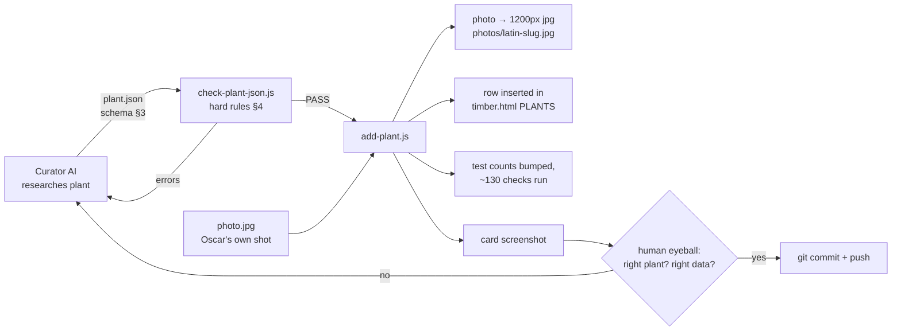

# Timber — how a plant gets built (paste this whole file to any AI you're working with)

Timber is a single-file PWA (`timber.html`) holding a `PLANTS` array. Adding a plant
is a data-in pipeline with hard validation; the card design is locked and never
touched. Two AIs share the work:

- **The curator** (ChatGPT or similar): researches one plant and emits a JSON block.
- **The builder** (Claude, attached to this repo): runs the JSON through the
  pipeline below, eyeballs the rendered card, commits and pushes.

The whole handoff is ONE artifact: a plant JSON in the exact schema in §3.
If the curator emits that schema correctly, the builder's job is a single command.
Every deviation (wrong scale, light level in the aspect field, prose peak dates)
costs a manual conversion round. That conversion is the slow part — eliminate it
at the source.

---

## 1. The pipeline in plain English

1. **Curate** — produce the plant JSON (schema §3, rules §4). Facts from the
   nursery label first, then RHS/standard UK horticulture. Unknown → leave blank.
   Never invent. Uncertain → say so in the `uncertain` array, not in the data.
2. **Validate** — `node tools/check-plant-json.js plant.json` applies every rule
   in §4 and refuses bad data (exit 1). Warnings and declared uncertainties print
   for human review.
3. **Add** — `node tools/add-plant.js plant.json photo.jpg` does everything:
   re-validates, resizes the photo to 1200px JPEG named by latin slug, inserts
   the row into `timber.html` before the `/* PLANTS:END */` marker, bumps the
   plant-count in both test suites, runs them (~130 headless-browser checks),
   and screenshots the new card.
4. **Look** — a human (or the builder) inspects `tools/last-added-card.png`.
   The photo must actually be the plant it claims to be — this has caught real
   mismatches before.
5. **Ship** — commit + push. The app fingerprints the plant list, so live users
   automatically get a fresh deck when it changes.

Aborts happen loudly and before anything is written: invalid JSON, duplicate
latin name, missing photo, or failing suites all stop the run.

---

## 2. The same thing as a diagram



---

## 3. The exact JSON schema the curator must emit

This is the builder-native schema. Emit exactly this — no other wrapper, no
different field names, no different scales.

```json
{
  "common": "Variegated Spanish Dagger",
  "latin": "Yucca gloriosa 'Variegata'",
  "hue": 55,
  "visual": "Rigid blue-green sword leaves broadly edged creamy yellow · architectural",
  "water": "Low once established",
  "aspect": "East / South",
  "soil": "Dry, gritty, well-drained",
  "soilWarning": "Sharp tips · toxic to pets · no winter wet",
  "prune": "",
  "peak": "Aug-Oct",
  "cvs": "syn. 'Aureovariegata'",
  "hardiness": "H5",
  "hardinessNote": "matches usual RHS band for Y. gloriosa",
  "resilience": "",
  "uses": "",
  "height": "1.5–2.5 m",
  "spread": "1.5–2.5 m",
  "foliage": "evergreen",
  "container": "yes",
  "growthSpeed": 8,
  "pestRisk": 6,
  "thirst": 6,
  "careLevel": 6,
  "sunNeed": 95,
  "sunMin": 72,
  "uncertain": [
    "hue inferred from photo, not label",
    "careLevel rated from rubric anchors — review"
  ]
}
```

| field | type | rule |
|---|---|---|
| `common`, `latin`, `hardiness` | string | **required, must be real** |
| `hue` | int 0–360 | **required.** HSL hue of the dominant feature. red 0 · orange 30 · yellow 55 · green 120 · blue 210 · purple 275 · pink 330 |
| `visual` | string ≤ ~90 chars | what it looks like / season of interest |
| `water` | string | watering regime in words — NOT soil drainage |
| `aspect` | string | **facing only**: `S`, `S/W`, `East / South`, `Any aspect`. NEVER "full sun" / "part shade" — light lives in `sunNeed` |
| `soil` | string ≤ 26 chars | soil type/drainage vocabulary; over 26 chars overflows the panel |
| `soilWarning` | string ≤ 44 chars | the caveat shown on the warning triangle — adds a constraint, never repeats the soil |
| `prune` | string | pruning in words |
| `peak` | `"Mon-Mon"` | must parse: `Jun-Sep`, `Aug-Oct`, `Jan-Dec` for year-round foliage. Prose like "Summer to Autumn" is REJECTED |
| `cvs` | string | notable cultivars of the species |
| `hardiness` | `H1a`…`H7` | RHS band. Don't default to H5 — check every plant |
| `height`, `spread` | strings | metric, e.g. `"60–90 cm"` |
| `foliage` | enum | `evergreen` / `semi-evergreen` / `deciduous` |
| `container` | enum | `yes` / `with care` / `no` |
| `growthSpeed`, `pestRisk`, `thirst`, `careLevel` | int 0–20 or blank | **0–20 scale, NOT 0–5.** 4 points = one icon on the card. If you think in /5, multiply by 4 |
| `sunNeed` | int 0–100 or blank | light wanted: 0 deep shade → 100 open full sun |
| `sunMin` | int 0–100 or blank | tolerated light floor; must be ≤ `sunNeed`. Renders the "wiggle room" marker |
| `uncertain` | string[] | anything inferred/unconfirmed. Uncertainty lives HERE, never in the data fields |
| commercial fields | — | `source order bench root trade retail margin type shrink returnRisk pots` — **NEVER fill.** Trade data comes only from Oscar; the validator errors if present |

Blank is always legal (except the four required fields) and always better than a
guess: a blank stat row simply doesn't render.

### Rating anchors (0–20)

- **pestRisk** (higher = more prone): 0–3 bulletproof (Choisya, Kniphofia) · 8–10 occasional aphid/mildew · 14–16 roses · 18–20 box blight
- **thirst** (higher = thirstier): 0–3 lavender/Sedum · 4–6 Kniphofia/Pennisetum · 10–12 average border · 16–20 Hydrangea/bog
- **careLevel** (higher = more work): 0–3 plant-and-forget · 6–8 light annual tidy · 12–14 roses · 18–20 dahlias/tender lifting
- **growthSpeed** (higher = faster): 0–4 Acer/box · 8–12 most shrubs · 16–18 Buddleja · 20 Leylandii
- **sunNeed**: 0–20 deep shade (Sarcococca, ferns) · 35–50 part shade (Hydrangea, Choisya) · 60–75 sun/light shade · 85–100 lavender/Kniphofia

---

## 4. What the validator actually enforces (condensed from tools/check-plant-json.js)

```js
// identity — required and real
['common','latin','hardiness'].forEach(f => required(f));
hue: integer 0..360, required;
hardiness: one of H1a H1b H1c H2 H3 H4 H5 H6 H7;
// H5 with no note prints a warning — H5 was the value every early mock-up wrongly carried

// scales — hard bounds; ≤5 on a 0-20 field warns "looks like an unconverted /5 rating"
{pestRisk,thirst,careLevel,growthSpeed}: int 0..20 | blank
sunNeed,sunMin: int 0..100 | blank;  sunMin > sunNeed → ERROR

// the compass rule — the single most common curator mistake
aspect contains "full sun|part shade|shade|dappled" with no compass word → ERROR
// light level belongs in sunNeed; aspect is which way the SITE faces

// soil hygiene
soil and soilWarning sharing words → warning (warning must ADD, not repeat)
water and soil sharing words → warning (drainage lives in ONE field)
soil > 26 chars → overflow warning;  soilWarning > 44 chars → overflow warning

// bloom
peak must parse as month range: "Jul-Oct" → [7,8,9,10] (wraps: "Oct-Feb" works)
prose ("Summer to Autumn", "Year-round") → ERROR — encode as Jun-Oct / Jan-Dec

// latin
capitalised genus; balanced quotes; "x" hybrid should be "×"

// commercial data — never researched, only Oscar's
any of source/order/bench/root/trade/retail/margin/type/shrink/returnRisk/pots
filled → ERROR "must come from Oscar, not research — remove it"
```

On PASS the validator prints the ready-to-paste `PLANTS` row and the photo slug
the image must be staged at.

---

## 5. What add-plant.js does (condensed from tools/add-plant.js)

```js
// node tools/add-plant.js plant.json photo.jpg — nothing written until all pass
1. execFileSync(check-plant-json.js)           // same rules as §4, exit on error
2. slug = latin.toLowerCase().replace(/[^a-z0-9]+/g,'-')
   duplicate latin already in PLANTS → ABORT
3. photo → headless-Chromium canvas → max 1200px wide JPEG → photos/<slug>.jpg
4. row string built from JSON (commercial fields hardcoded blank)
   → inserted before the '/* PLANTS:END */' marker in timber.html
5. NPLANTS bumped in tests/app-test.js + tests/edge-test.js (regex rewrite)
6. both suites run against a local server (~130 checks incl. data integrity)
7. new card screenshotted → tools/last-added-card.png   // LOOK AT IT
   any suite failure → loud abort message, nothing gets committed
```

Bulk alternative: `PORTFOLIO-BUILD-BRIEF.md` defines a 31-column CSV row format
for batching many plants; `plants-tool.js import` validates and rewrites the
whole array. Same rules, spreadsheet-shaped.

---

## 6. Division of labour + where the time goes

| step | owner | cost when done right | cost when done wrong |
|---|---|---|---|
| research + JSON | curator AI | minutes | — |
| schema conversion | builder | **zero if schema §3 is emitted** | one full manual round: re-mapping fields, ×4 scale conversion, compressing warnings, encoding peaks |
| validation | script | seconds | — |
| add + test + screenshot | script | ~3 min | — |
| eyeball + commit | builder/Oscar | ~1 min | — |

Real conversion rounds this repo has already paid for (don't repeat them):

- ratings emitted as **1.5/5** instead of **6/20**
- `aspect: "Full sun to part shade"` (light level) instead of a facing + `sunNeed`
- `peak: "Summer to Autumn"` instead of `"Jun-Oct"`
- 120-char safety warning that had to be hand-compressed to ≤44 for the card zone
- missing `hue` (required — builder had to infer it from the photo)
- a different field-name scheme entirely (`commonName`, `stature.height`,
  `light.scaleValue`) that had to be re-mapped field by field

## 7. Instruction block to give the curator AI

> You are curating plants for Timber. For each plant, output ONE fenced JSON
> block in exactly the schema of §3 above — same field names, same scales
> (0–20 ratings, 0–100 sun), nothing extra. Facts from the label first, then
> RHS/UK horticulture. Blank any field you can't verify and list why in
> `uncertain`. Aspect = compass facing only or "Any aspect"; light goes in
> `sunNeed`/`sunMin`. `peak` must be "Mon-Mon". `soil` ≤26 chars,
> `soilWarning` ≤44 chars — pre-compress to fit. Never fill commercial fields.
> Never guess hardiness — check it. Output nothing else except the JSON block
> and a short uncertainty note.
